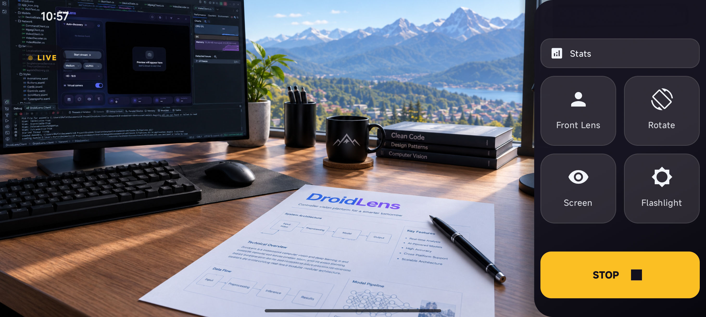
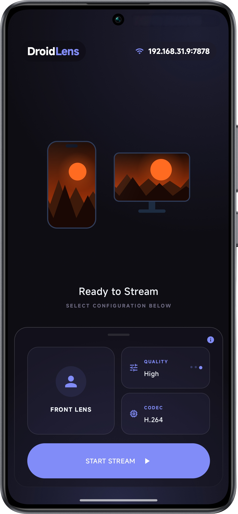
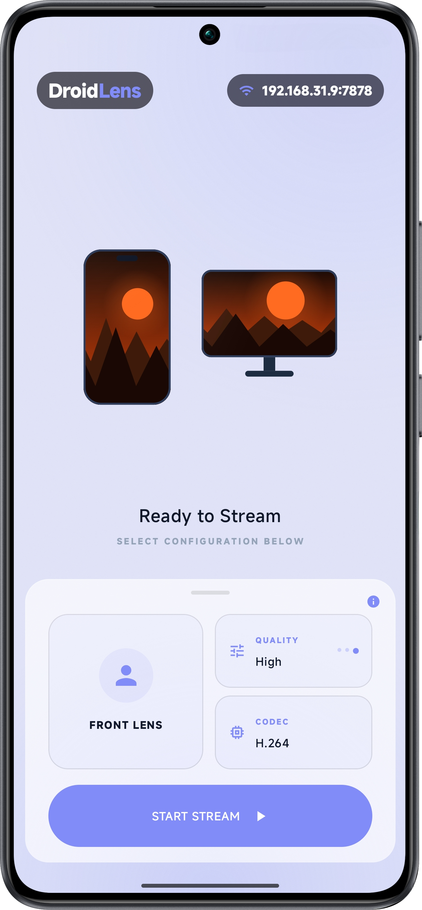
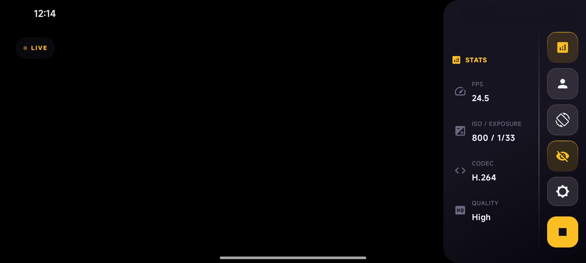

# DroidLens — Android Application

The mobile camera streamer for DroidLens: captures the camera, encodes on hardware, and serves the stream to the Windows client over Wi-Fi or USB — with on-device controls, live stats, and an OLED-friendly black screen mode.

##  Screenshots

<p align="center">
  
  <br />
  <em>Live stream — camera preview with Stats, lens, rotate, black-screen, flashlight controls and STOP</em>
</p>

<table>
  <tr>
    <td align="center" width="50%">
      
      <br />
      <em>Ready to stream — dark theme, front lens, quality and codec (H.264) selection</em>
    </td>
    <td align="center" width="50%">
      
      <br />
      <em>Ready to stream — same setup in light variant</em>
    </td>
  </tr>
  <tr>
    <td align="center" colspan="2">
      
      <br />
      <em>Stream stats — live FPS, ISO/exposure, codec and quality overlay</em>
    </td>
  </tr>
</table>

##  Tech Stack
* **Language:** Kotlin (Java 11 toolchain)
* **UI Framework:** [Jetpack Compose](https://developer.android.com/jetpack/compose) + Material 3 (BOM 2025.05.00)
* **Camera API:** [AndroidX CameraX 1.4.2](https://developer.android.com/training/camerax) (`core`, `camera2`, `lifecycle`, `view`) with Camera2 interop for FPS ranges and exposure capture
* **Hardware Encoding:** Android `MediaCodec` — H.264 (`video/avc`) & H.265/HEVC (`video/hevc`) at 30 fps, 1 s keyframe interval, low-latency flags where the OS supports them
* **Discovery:** Android NSD (`NsdManager` / DNS-SD) announcing `_DroidLens._tcp.` with the device model
* **Design & Effects:** [Haze](https://github.com/chrisbanes/haze) 1.6.5 (glassmorphic blur, auto-disabled in Power Save mode)
* **Persistence:** DataStore Preferences (lens, codec, quality, resolution)

##  Streaming

* **Codecs:** H.264 and H.265 via `MediaCodec`, plus an MJPEG fallback (`YuvImage` → JPEG multipart). Quality presets scale both: JPEG quality and per-codec bitrate (H.265 needs ~60–70% of the H.264 bitrate for the same quality).
* **Resolutions:** SD (720×480), HD (1280×720), Full HD (1920×1080) — picked against real `StreamConfigurationMap` sizes with closest-match fallback.
* **Clean joins:** newly connected viewers wait for a fresh keyframe before receiving frames, and a keyframe is requested the moment a client joins — so a decoder always starts clean.
* **Wire format:** Annex-B NAL units sent length-prefixed (`[4-byte size][data]`) over raw TCP.

##  Discovery

Registers `_DroidLens._tcp.` via `NsdManager` on the command port, exposing a `model` attribute (marketing name when available, e.g. `POCO F6`). The PC client listens passively — no subnet scanning involved on either side.

##  Protocol

| Port | Transport | Direction | Purpose |
|:---:|:---:|:---:|:---|
| **`7878`** | HTTP Multipart | Phone → PC | MJPEG video stream |
| **`7879`** | TCP / JSON | Bidirectional | Commands, state, ping/pong heartbeat |
| **`7880`** | TCP Raw | Phone → PC | Length-prefixed H.264 Annex-B NAL stream |
| **`7881`** | TCP Raw | Phone → PC | Length-prefixed H.265 (HEVC) Annex-B NAL stream |

Accepts: `start`, `stop`, `set_codec`, `set_quality`, `set_resolution`, `flip_camera`, `rotate`, `flashlight`, `black_screen` (plus `ping`). Pushes back `device_info`, `stream_status` (every 2 s), `battery` + `net` (every 10 s), and `pong`.

##  Controls & Extras

* **Lens & orientation:** front/back switching, rotation, three resolutions.
* **Flashlight:** back-camera torch, or full screen brightness for the front camera.
* **Black screen mode:** keeps the camera and encoders running while the preview goes fully black and the screen output stops — minimal heat and battery drain during long streams.
* **Stats overlay:** live FPS, ISO/exposure, codec, and quality sampled from the capture session.

##  Battery & Power Save

Reports battery level, charging state, and temperature to the PC client; holds a wake lock while streaming with the screen kept on. In Power Save mode (including MIUI battery saver) the glass blur and idle animations switch to cheap static fallbacks.

##  Requirements
* Android 8.0+ (API level 26 or higher)
* Device with Camera2 support

##  Building from Source
Using Gradle:

* **Debug Build:**
  ```bash
  ./gradlew assembleDebug
  ```
* **Release Build:**
  ```bash
  ./gradlew assembleRelease
  ```

Output APK:
`app/build/outputs/apk/release/app-release.apk`

##  Localization
12 locales via Android resources (system language applies automatically): English (default), Arabic, German, Spanish, French, Italian, Japanese, Korean, Polish, Portuguese, Ukrainian, Chinese.

##  Theme
Dark and light schemes following the system theme, with the same glassmorphic look as the Windows client.
