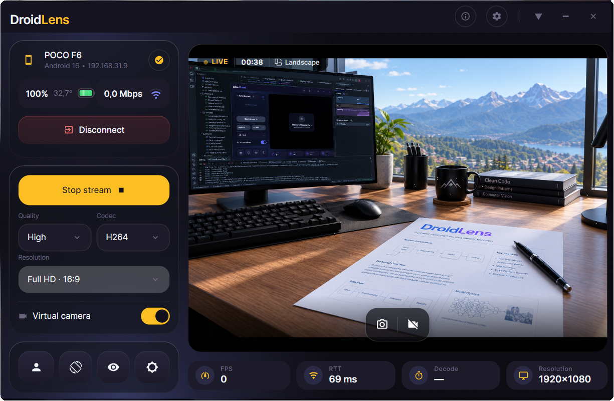
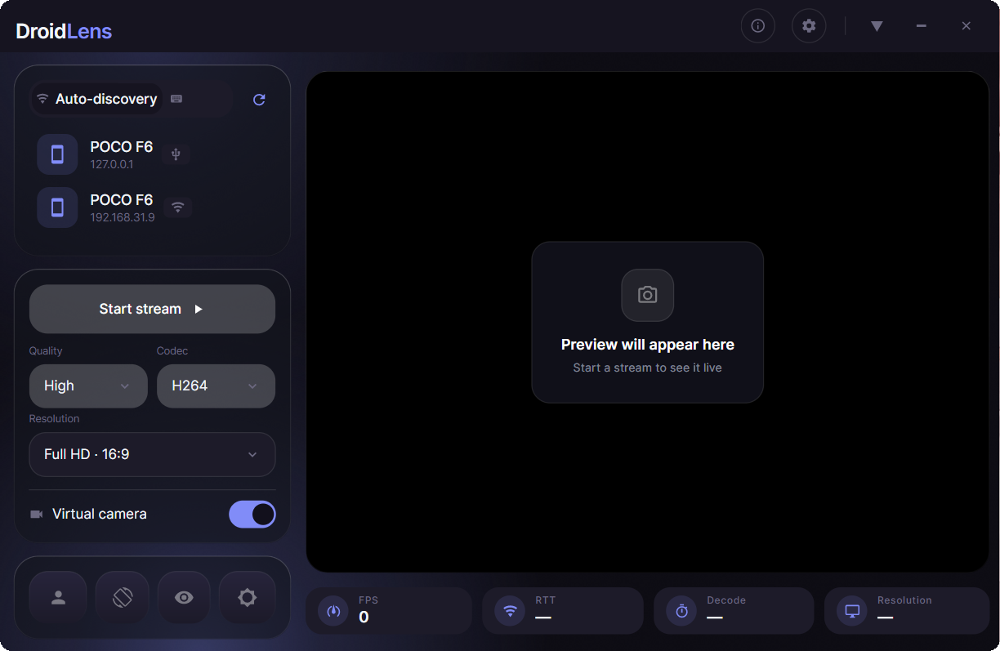
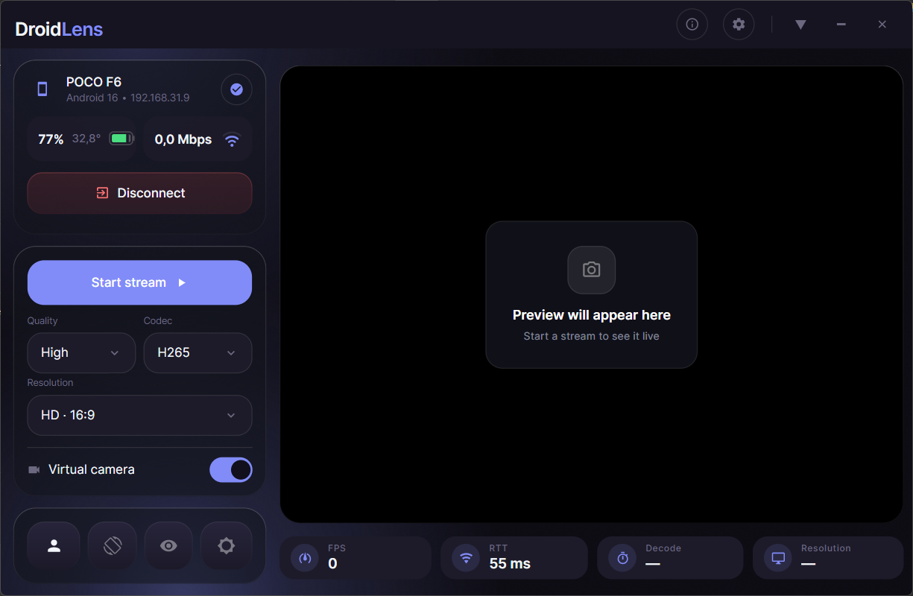
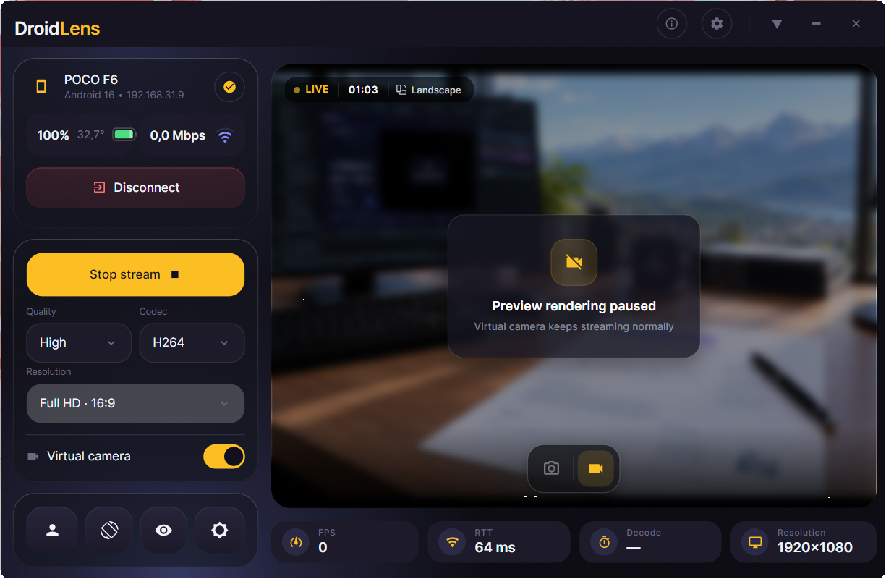
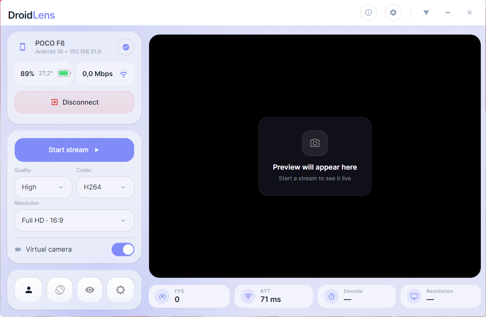
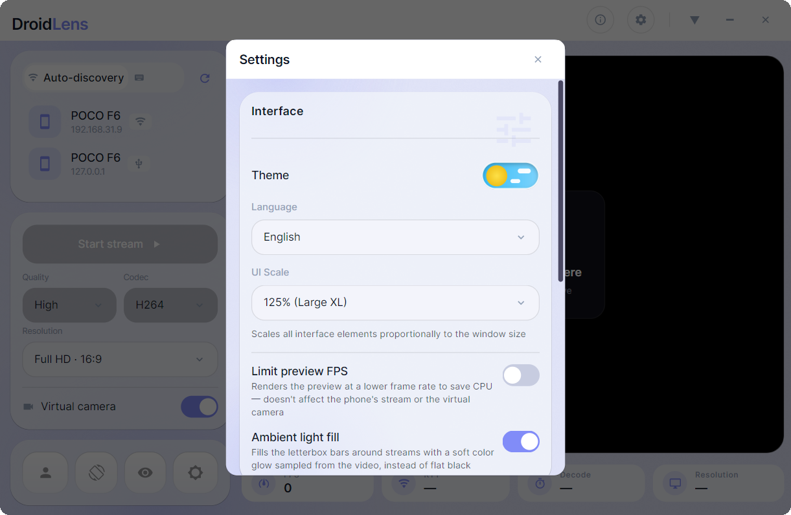

# DroidLens — Windows PC Client

The desktop receiver and virtual camera pipeline for DroidLens.

##  Screenshots

<p align="center">
  
  <br />
  <em>Live stream — Full HD (1920×1080) over Wi-Fi with RTT, decode and resolution telemetry</em>
</p>

<table>
  <tr>
    <td align="center" width="50%">
      
      <br />
      <em>Auto-discovery — USB (127.0.0.1) and Wi-Fi (192.168.31.9) devices</em>
    </td>
    <td align="center" width="50%">
      
      <br />
      <em>Connected & idle — battery, temperature, bitrate and codec selection (H.265 / HD)</em>
    </td>
  </tr>
  <tr>
    <td align="center" width="50%">
      
      <br />
      <em>Preview paused — local preview off, virtual camera keeps streaming</em>
    </td>
    <td align="center" width="50%">
      
      <br />
      <em>Light theme — same workflow in Fluent light variant</em>
    </td>
  </tr>
  <tr>
    <td align="center" colspan="2">
      
      <br />
      <em>Settings — theme, language, UI scale, preview FPS limit and ambient light fill</em>
    </td>
  </tr>
</table>

##  Tech Stack
* **Runtime:** .NET 10 (`net10.0-windows`, `win-x64`)
* **UI Framework:** [Avalonia UI 11](https://avaloniaui.net/) with Fluent styling
* **Video Decoding:** [Sdcb.FFmpeg](https://github.com/sdcb/Sdcb.FFmpeg) 7.0 + `FFmpeg.LGPL` (D3D11VA hardware acceleration + CPU fallback)
* **Virtual Camera:** DirectShow filter powered by [softcam](https://github.com/tshino/softcam) (MIT)
* **Service Discovery:** [Makaretu.Dns.Multicast.New](https://github.com/StephenCleary/Makaretu.Dns.Multicast) (RFC 6762 mDNS / DNS-SD)
* **USB Transport:** [AdvancedSharpAdbClient](https://github.com/quamotion/madb) driving bundled ADB tools

##  System Requirements
* Windows 10 / 11 x64
* [.NET 10 SDK](https://dotnet.microsoft.com/download/dotnet/10.0) (for building from source)

##  Building a Release Binary
```bash
dotnet publish -c Release -r win-x64 --self-contained true
```
The output binary will be located in:
`bin/Release/net10.0-windows/win-x64/publish/DroidLens.exe`

##  Virtual Camera Registration
On first launch, register the bundled `softcam.dll` as administrator:
```cmd
regsvr32 "%CD%\softcam.dll"
```
After registration, `DirectShow Softcam` will appear in OBS Studio, Discord, Zoom, Google Meet, and web browsers.
